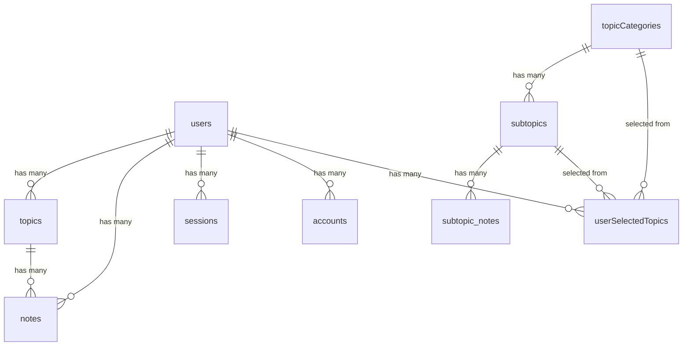

# DevTrack AI — Complete Interview Prep Guide

> **What is DevTrack AI?** An AI-powered learning tracker for developers. Users can organize topics they're learning, write/generate notes with AI, track progress, take AI-generated quizzes, and browse a structured topic catalog.

---

## 📦 Full Tech Stack

| Layer | Technology | Purpose |
|-------|-----------|---------|
| Framework | **Next.js 16** (App Router) | Full-stack React framework |
| Language | **TypeScript** | Type safety |
| Database | **PostgreSQL** | Relational data storage |
| ORM | **Drizzle ORM** | Type-safe SQL queries |
| Auth | **BetterAuth** | Authentication & sessions |
| AI | **Vercel AI SDK** + **Groq** (Llama 3.3 70B) | AI note & quiz generation |
| UI | **Radix UI** + **shadcn/ui** | Accessible component primitives |
| Styling | **Tailwind CSS v4** | Utility-first styling |
| Animation | **Framer Motion** | Page transitions & micro-interactions |
| Notifications | **Sonner** | Toast notifications |
| Package Manager | **pnpm** | Fast, disk-efficient |

---

## 1. Next.js 16 — App Router (Detailed)

### 1.1 What is the App Router?

Next.js 16 uses the **App Router** (`app/` directory) instead of the legacy Pages Router (`pages/`). The App Router is built on **React Server Components (RSC)** by default.

**Key difference from Pages Router:**
- Pages Router: every page is a Client Component by default
- App Router: every component is a **Server Component** by default. You opt-in to client with `"use client"`

### 1.2 Folder-Based Routing

Every folder inside `app/` becomes a URL segment. A `page.tsx` inside a folder makes it a route.

```
app/
├── page.tsx                          → /              (landing page)
├── layout.tsx                        → Root layout (wraps everything)
├── (auth)/                           → Route Group (no URL segment)
│   ├── layout.tsx                    → Auth-specific layout
│   ├── login/page.tsx                → /login
│   └── signup/page.tsx               → /signup
├── (dashboard)/                      → Route Group (no URL segment)
│   ├── layout.tsx                    → Dashboard layout (with Sidebar)
│   ├── dashboard/page.tsx            → /dashboard
│   ├── topics/page.tsx               → /topics
│   ├── topics/[topicId]/page.tsx     → /topics/:topicId  (dynamic route)
│   ├── catalog/page.tsx              → /catalog
│   ├── my-topics/page.tsx            → /my-topics
│   └── settings/page.tsx             → /settings
└── api/                              → API Route Handlers
    ├── auth/[...all]/route.ts        → /api/auth/*  (catch-all)
    ├── auth/me/route.ts              → /api/auth/me
    ├── topics/route.ts               → /api/topics
    ├── topics/[topicId]/route.ts     → /api/topics/:topicId
    ├── catalog/route.ts              → /api/catalog
    ├── user-topics/route.ts          → /api/user-topics
    ├── ai/generate-notes/route.ts    → /api/ai/generate-notes
    └── ai/generate-quiz/route.ts     → /api/ai/generate-quiz
```

### 1.3 Route Groups — `(auth)` and `(dashboard)`

**What:** Parenthesized folders like `(auth)` organize routes **without adding URL segments**.

**Why we use them:**
- `(auth)` group → login/signup pages get a centered, minimal layout (no sidebar)
- `(dashboard)` group → dashboard/topics/catalog pages get a layout **with Sidebar**

```tsx
// app/(auth)/layout.tsx — Centered layout, no sidebar
export default function AuthLayout({ children }) {
  return (
    <main className="min-h-screen flex items-center justify-center">
      {children}
    </main>
  );
}

// app/(dashboard)/layout.tsx — Sidebar layout
export default function DashboardLayout({ children }) {
  return (
    <div className="flex min-h-screen">
      <Sidebar />
      <div className="flex-1">{children}</div>
    </div>
  );
}
```

> **Interview answer:** "I used route groups to apply different layouts to different areas of the app — auth pages get a clean centered layout, while dashboard pages get a shared sidebar. The parentheses mean the folder name doesn't appear in the URL."

### 1.4 Dynamic Routes — `[topicId]`

`app/(dashboard)/topics/[topicId]/page.tsx` creates a dynamic route. The `topicId` is extracted from the URL.

**In Next.js 16, params is a Promise:**
```tsx
export default function TopicDetailPage({
  params,
}: {
  params: Promise<{ topicId: string }>
}) {
  const { topicId } = use(params);  // React's use() hook to unwrap the Promise
  // ...
}
```

### 1.5 Catch-All Routes — `[...all]`

`app/api/auth/[...all]/route.ts` matches **any** path under `/api/auth/`.

This is how BetterAuth works — it handles many sub-routes like `/api/auth/sign-in`, `/api/auth/sign-up`, `/api/auth/session`, etc.

```tsx
import { auth } from "@/lib/auth";
import { toNextJsHandler } from "better-auth/next-js";

export const { GET, POST } = toNextJsHandler(auth);
```

> **Interview answer:** "The catch-all route `[...all]` delegates every request under `/api/auth/*` to BetterAuth's internal handler. BetterAuth manages all auth sub-routes internally."

### 1.6 Server Components vs Client Components

| Feature | Server Component | Client Component |
|---------|-----------------|------------------|
| Default | ✅ Yes | Must add `"use client"` |
| Can use `async/await` | ✅ | ❌ |
| Can access DB directly | ✅ | ❌ |
| Can use `useState`/`useEffect` | ❌ | ✅ |
| Can use event handlers | ❌ | ✅ |
| Shipped to browser | ❌ (HTML only) | ✅ (JS bundle) |

**In your project:**
- **Server Component:** `dashboard/page.tsx` — fetches data directly from the DB using Drizzle
- **Client Components:** `topics/page.tsx`, `login/page.tsx`, `Sidebar.tsx` — use hooks, state, event handlers

```tsx
// SERVER COMPONENT — dashboard/page.tsx
// No "use client" directive. Runs ONLY on the server.
export default async function DashboardPage() {
  const session = await auth.api.getSession({ headers: await headers() });
  if (!session) redirect("/login");

  // Direct database access! No API call needed.
  const userTopics = await db
    .select()
    .from(topics)
    .where(eq(topics.userId, session.user.id));

  return <div>{/* render with data */}</div>;
}
```

```tsx
// CLIENT COMPONENT — topics/page.tsx
"use client";  // ← This makes it a client component

export default function TopicsPage() {
  const { topics, loading } = useTopics();  // useState + useEffect inside
  return <div>{/* interactive UI */}</div>;
}
```

> **Interview answer:** "The dashboard page is a Server Component — it queries the database directly without an API call, which is faster and more secure because no data-fetching code is sent to the browser. The topics page is a Client Component because it needs interactivity — state management for CRUD operations and user interactions."

### 1.7 Nested Layouts

Layouts wrap their child routes and **persist across navigations** (they don't re-render).

```
Root Layout (app/layout.tsx)
  ├── Auth Layout (app/(auth)/layout.tsx)
  │     ├── Login Page
  │     └── Signup Page
  └── Dashboard Layout (app/(dashboard)/layout.tsx)
        ├── Dashboard Page
        ├── Topics Page
        └── Catalog Page
```

The root layout applies `<Toaster />` (sonner) globally. The dashboard layout adds the `<Sidebar />`.

### 1.8 API Route Handlers

Next.js App Router uses `route.ts` files that export HTTP method handlers:

```tsx
// app/api/topics/route.ts
export async function GET() { ... }    // Handles GET /api/topics
export async function POST() { ... }   // Handles POST /api/topics

// app/api/topics/[topicId]/route.ts
export async function GET() { ... }    // GET /api/topics/:id
export async function PATCH() { ... }  // PATCH /api/topics/:id
export async function DELETE() { ... } // DELETE /api/topics/:id
```

**Pattern in every API route:**
1. Authenticate (check session)
2. Validate input
3. Database operation with Drizzle
4. Return `NextResponse.json()`

### 1.9 Middleware

```tsx
// middleware.ts
const protectedRoutes = ["/dashboard", "/topics", "/settings", "/catalog", "/my-topics"];
const authRoutes = ["/login", "/signup"];

export async function middleware(request: NextRequest) {
  const sessionCookie =
    request.cookies.get("better-auth.session_token") ||
    request.cookies.get("__Secure-better-auth.session_token");

  // If accessing protected route without session → redirect to /login
  if (isProtected && !sessionCookie) {
    return NextResponse.redirect(new URL("/login", request.url));
  }

  // If accessing auth route WITH session → redirect to /dashboard
  if (isAuthRoute && sessionCookie) {
    return NextResponse.redirect(new URL("/dashboard", request.url));
  }
}
```

**How middleware works:**
- Runs **before** every request (on the Edge Runtime)
- It checks for the BetterAuth session cookie
- **Does NOT validate the session** — just checks cookie existence (fast check)
- The actual session validation happens in API routes / Server Components
- The `matcher` config excludes API routes and static assets

> **Interview answer:** "Middleware acts as a first-pass guard. It checks if the BetterAuth session cookie exists — it doesn't validate the token, which would be slow on the edge. The actual session validation happens server-side in API routes and server components."

### 1.10 Metadata & SEO

```tsx
// app/layout.tsx
export const metadata: Metadata = {
  title: "DevTrack AI",
  description: "Smart Learning Tracker for Developers",
};
```

Next.js automatically generates `<head>` tags from this export.

### 1.11 Google Fonts via `next/font`

```tsx
import { Geist } from "next/font/google";
const geist = Geist({ subsets: ["latin"] });
// Used: <body className={geist.className}>
```

`next/font` **self-hosts** the font — no external requests to Google at runtime, improving performance and privacy.

---

## 2. Drizzle ORM (Detailed)

### 2.1 What is Drizzle?

Drizzle is a **TypeScript-first SQL ORM**. Unlike Prisma (which has its own schema language), Drizzle schemas are **pure TypeScript**. It generates SQL that's very close to what you'd write by hand.

**Drizzle vs Prisma:**

| Feature | Drizzle | Prisma |
|---------|---------|--------|
| Schema Language | TypeScript | `.prisma` DSL |
| Query Style | SQL-like | Object-oriented |
| Bundle Size | ~7.4KB | ~800KB+ |
| Type Safety | Full (from TS schema) | Full (from codegen) |
| Migration | SQL-first | Auto-generated |

### 2.2 How Drizzle Works — The Pipeline

```
1. Schema (TypeScript)  →  2. drizzle-kit generate  →  3. SQL Migration Files
                                                              ↓
4. drizzle-kit migrate  →  5. Applies SQL to PostgreSQL database
                                                              ↓
6. Application code uses schema types for type-safe queries
```

### 2.3 Schema Definition

```tsx
// lib/db/schema.ts
import { pgTable, text, timestamp, boolean, integer, pgEnum } from "drizzle-orm/pg-core";

// Step 1: Define enums
export const topicStatusEnum = pgEnum("topic_status", [
  "not_started", "in_progress", "completed"
]);

// Step 2: Define tables
export const users = pgTable("users", {
  id: text("id").primaryKey(),
  role: text("role").default("user").notNull(),
  name: text("name").notNull(),
  email: text("email").notNull().unique(),
  emailVerified: boolean("email_verified").default(false).notNull(),
  image: text("image"),
  createdAt: timestamp("created_at", { withTimezone: true, mode: "string" }).defaultNow().notNull(),
  updatedAt: timestamp("updated_at", { withTimezone: true, mode: "string" }).defaultNow().notNull(),
});

// Step 3: Define relations with foreign keys
export const topics = pgTable("topics", {
  id: text("id").primaryKey(),
  userId: text("user_id")
    .notNull()
    .references(() => users.id, { onDelete: "cascade" }),  // FK with cascade delete
  name: text("name").notNull(),
  status: topicStatusEnum("status").default("not_started").notNull(),
  progress: integer("progress").default(0).notNull(),
  // ...
});
```

**Key concepts to explain:**
- `pgTable()` — defines a PostgreSQL table
- `.references(() => users.id, { onDelete: "cascade" })` — foreign key that auto-deletes related rows
- `pgEnum()` — PostgreSQL enum type (stored as a database enum, not a string)
- `.defaultNow()` — SQL `DEFAULT NOW()` for timestamps

### 2.4 Database Connection

```tsx
// lib/db/index.ts
import { drizzle } from "drizzle-orm/node-postgres";
import { Pool } from "pg";
import * as schema from "./schema";

const pool = new Pool({
  connectionString: process.env.DATABASE_URL!,
});

export const db = drizzle(pool, { schema });
```

**Flow:**
1. `pg` (node-postgres) creates a **connection pool** to PostgreSQL
2. `drizzle()` wraps the pool with Drizzle's query builder
3. Passing `schema` enables Drizzle's relational queries

### 2.5 Drizzle Config

```tsx
// drizzle.config.ts
export default {
  schema: "./lib/db/schema.ts",     // Where schema is defined
  out: "./drizzle/migrations",       // Where migration SQL files go
  dialect: "postgresql",
  dbCredentials: {
    url: process.env.DATABASE_URL!,
  },
} satisfies Config;
```

### 2.6 Migration Commands

```bash
pnpm db:generate   # Reads schema.ts, generates SQL migration file
pnpm db:migrate    # Runs pending SQL migrations against the database
pnpm db:push       # Pushes schema changes directly (dev only, no migration file)
pnpm db:studio     # Opens Drizzle Studio (visual DB browser)
```

### 2.7 Query Examples from Your Code

**SELECT with WHERE:**
```tsx
const userTopics = await db
  .select()
  .from(topics)
  .where(eq(topics.userId, session.user.id))
  .orderBy(topics.createdAt);
```

**INSERT with RETURNING:**
```tsx
const newTopic = await db
  .insert(topics)
  .values({
    id: generateId(),       // crypto.randomUUID()
    userId: session.user.id,
    name: name.trim(),
    status: "not_started",
    progress: 0,
  })
  .returning();  // Returns the inserted row (PostgreSQL feature)
```

**UPDATE with WHERE:**
```tsx
const updated = await db
  .update(topics)
  .set({ name, status, progress, updatedAt: new Date() })
  .where(eq(topics.id, topicId))
  .returning();
```

**DELETE:**
```tsx
await db.delete(topics).where(eq(topics.id, topicId));
```

**Complex query — AND conditions:**
```tsx
const existing = await db
  .select()
  .from(userSelectedTopics)
  .where(
    and(
      eq(userSelectedTopics.userId, session.user.id),
      eq(userSelectedTopics.categoryId, categoryId),
      eq(userSelectedTopics.subtopicId, subtopicId)
    )
  )
  .limit(1);
```

### 2.8 Database Schema — All Tables



**Tables:**
1. `users` — User accounts (id, name, email, role, etc.)
2. `sessions` — Active login sessions (linked to users)
3. `accounts` — OAuth/credential accounts (linked to users)  
4. `verifications` — Email verification tokens
5. `topics` — User's personal learning topics (name, status, progress)
6. `notes` — Notes attached to topics (can be AI-generated)
7. `topicCategories` — Admin-managed catalog categories (e.g., "Frontend", "Backend")
8. `subtopics` — Sub-items under categories (e.g., "React", "Node.js")
9. `subtopic_notes` — Concepts under subtopics (e.g., "Hooks", "Middleware")
10. `userSelectedTopics` — Junction table: which catalog items a user has selected

---

## 3. BetterAuth (Detailed)

### 3.1 What is BetterAuth?

BetterAuth is a **framework-agnostic TypeScript authentication library**. Unlike NextAuth, it:
- Manages its own session store in your database
- Works with any ORM (has adapters for Drizzle, Prisma, etc.)
- Handles both server and client auth flows
- Is framework-agnostic but has first-class Next.js support

### 3.2 Server-Side Setup

```tsx
// lib/auth/index.ts
import { betterAuth } from "better-auth";
import { drizzleAdapter } from "better-auth/adapters/drizzle";

export const auth = betterAuth({
  // 1. Database adapter — tells BetterAuth to store data via Drizzle
  database: drizzleAdapter(db, {
    provider: "pg",
    schema: {
      user: schema.users,        // Map to your users table
      session: schema.sessions,  // Map to your sessions table
      account: schema.accounts,
      verification: schema.verifications,
    }
  }),
  
  // 2. Enable email/password auth
  emailAndPassword: {
    enabled: true,
  },
  
  // 3. Session configuration
  session: {
    expiresIn: 60 * 60 * 24 * 7,  // 7 days in seconds
  },
  
  baseURL: getBaseURL(),  // Resolves for local/Vercel environments
});
```

### 3.3 How the Auth Flow Works

```
┌─────────────────────────────────────────────────────────────┐
│                     USER SIGNS UP                            │
│                                                              │
│  1. Client calls signUp.email({ name, email, password })     │
│  2. BetterAuth client sends POST /api/auth/sign-up           │
│  3. Catch-all route [..all]/route.ts delegates to BetterAuth │
│  4. BetterAuth:                                              │
│     a. Hashes the password (bcrypt)                          │
│     b. INSERT into users table via Drizzle adapter           │
│     c. INSERT into accounts table (provider: "credential")   │
│     d. Creates a session → INSERT into sessions table        │
│     e. Sets session cookie: "better-auth.session_token"      │
│  5. Client receives success → router.push("/dashboard")      │
└─────────────────────────────────────────────────────────────┘

┌─────────────────────────────────────────────────────────────┐
│                     USER LOGS IN                             │
│                                                              │
│  1. Client calls signIn.email({ email, password })           │
│  2. POST /api/auth/sign-in → BetterAuth handler              │
│  3. BetterAuth:                                              │
│     a. Looks up user by email                                │
│     b. Verifies password hash                                │
│     c. Creates new session → INSERT into sessions            │
│     d. Sets cookie: "better-auth.session_token"              │
│  4. Subsequent requests include this cookie automatically    │
└─────────────────────────────────────────────────────────────┘

┌─────────────────────────────────────────────────────────────┐
│                 SESSION VALIDATION                            │
│                                                              │
│  Server Component / API Route:                               │
│  1. auth.api.getSession({ headers: await headers() })        │
│  2. BetterAuth reads cookie from headers                     │
│  3. Looks up session token in sessions table                 │
│  4. If valid & not expired → returns { user, session }       │
│  5. If invalid → returns null                                │
└─────────────────────────────────────────────────────────────┘
```

### 3.4 Client-Side Auth

```tsx
// lib/auth/client.ts
import { createAuthClient } from "better-auth/react";

export const authClient = createAuthClient({
  baseURL: process.env.NEXT_PUBLIC_BETTER_AUTH_URL || "http://localhost:3000",
});

// Destructure commonly used functions
export const { signIn, signOut, signUp, useSession } = authClient;
```

**Usage in login page:**
```tsx
"use client";
import { signIn } from "@/lib/auth/client";

const handleSubmit = async (e) => {
  const { error } = await signIn.email({
    email: form.email,
    password: form.password,
  });
  if (error) { toast("Login failed"); return; }
  router.push("/dashboard");
};
```

### 3.5 The Catch-All API Route

```tsx
// app/api/auth/[...all]/route.ts
import { auth } from "@/lib/auth";
import { toNextJsHandler } from "better-auth/next-js";

export const { GET, POST } = toNextJsHandler(auth);
```

This single file handles ALL these endpoints:
- `POST /api/auth/sign-up`
- `POST /api/auth/sign-in`
- `GET /api/auth/session`
- `POST /api/auth/sign-out`
- And more...

### 3.6 Role-Based Access Control (RBAC)

```tsx
// lib/auth/admin.ts
export async function getSessionWithRole() {
  const session = await auth.api.getSession({ headers: await headers() });
  if (!session) return null;

  // Fetch role from DB (BetterAuth session doesn't include custom fields)
  const user = await db
    .select({ role: users.role })
    .from(users)
    .where(eq(users.id, session.user.id))
    .limit(1);

  return { ...session, user: { ...session.user, role: user[0]?.role ?? "user" } };
}

export function isAdmin(session) {
  return session?.user?.role === "admin";
}
```

**Used in catalog POST route (admin-only):**
```tsx
const session = await getSessionWithRole();
if (!session || !isAdmin(session)) {
  return NextResponse.json({ error: "Forbidden" }, { status: 403 });
}
```

### 3.7 Three Layers of Auth Protection

| Layer | Where | What It Does |
|-------|-------|-------------|
| **Middleware** | `middleware.ts` | Cookie existence check → fast redirect |
| **Server Components** | `dashboard/page.tsx` | `auth.api.getSession()` → full validation |
| **API Routes** | `api/topics/route.ts` | `auth.api.getSession()` → full validation |

> **Interview answer:** "I have three layers of auth. Middleware is the first gate — it runs on the Edge and just checks if the session cookie exists. Server Components and API routes do the real validation by calling `auth.api.getSession()`, which looks up the session in the database."

---

## 4. Vercel AI SDK (Detailed)

### 4.1 What is the Vercel AI SDK?

The Vercel AI SDK (`ai` package) is a **unified TypeScript interface** for working with AI models from different providers (OpenAI, Google, Anthropic, Groq, etc.).

**Key benefit:** You can swap AI providers by changing one line — the API stays the same.

### 4.2 Provider Pattern

```tsx
// lib/ai/index.ts
import { createGroq } from "@ai-sdk/groq";

export const groq = createGroq({
  apiKey: process.env.GROQ_API_KEY!,
});
```

This creates a **provider instance**. Your project has three provider packages installed:
- `@ai-sdk/groq` — **actively using** (Groq hosts Llama 3.3 70B)
- `@ai-sdk/google` — installed (could switch to Gemini)
- `@ai-sdk/openai` — installed (could switch to GPT)

**To switch providers, you'd just change:**
```tsx
// From Groq:
model: groq("llama-3.3-70b-versatile")
// To OpenAI:
model: openai("gpt-4o")
// To Google:
model: google("gemini-2.0-flash")
```

### 4.3 `generateText()` — Core Function

The `generateText()` function sends a prompt to an AI model and returns the complete response.

```tsx
import { generateText } from "ai";

const { text } = await generateText({
  model: groq("llama-3.3-70b-versatile"),  // Which model to use
  system: "You are an expert developer educator...",  // System prompt
  prompt: "Generate notes about React hooks",          // User prompt
});
```

**Parameters:**
- `model` — The AI model to use (from a provider)
- `system` — System prompt (defines AI's role/behavior)
- `prompt` — The actual user request
- Returns `{ text }` — The generated text

### 4.4 AI Feature 1: Note Generation

```tsx
// app/api/ai/generate-notes/route.ts
export async function POST(request: NextRequest) {
  // 1. Auth check
  const session = await getSession();
  if (!session) return NextResponse.json({ error: "Unauthorized" }, { status: 401 });

  // 2. Build prompt
  const { topicName, subtopic } = await request.json();
  const prompt = subtopic
    ? `Generate notes about "${subtopic}" within ${topicName}.`
    : `Generate notes about ${topicName}.`;

  // 3. Call AI
  const { text } = await generateText({
    model: groq("llama-3.3-70b-versatile"),
    system: `You are an expert developer educator. Generate concise, practical notes...
      - Start with 1-2 sentence overview
      - Use clear sections with headers (##)
      - Include code examples
      - Maximum 400 words`,
    prompt,
  });

  // 4. Return generated text
  return NextResponse.json({ content: text });
}
```

### 4.5 AI Feature 2: Quiz Generation

```tsx
// app/api/ai/generate-quiz/route.ts
const { text } = await generateText({
  model: groq("llama-3.3-70b-versatile"),
  system: `You are a developer educator creating quiz questions.
    Return ONLY a valid JSON array, no markdown, no explanation.
    Format: [{"question": "...", "options": ["A","B","C","D"], "answer": "A", "explanation": "..."}]`,
  prompt: `Generate 5 multiple choice quiz questions for ${topicName}. ${context}`,
});

// Parse the JSON response
const clean = text.replace(/```json|```/g, "").trim();  // Strip markdown fences
const quiz = JSON.parse(clean);
return NextResponse.json({ quiz });
```

**Key technique:** The system prompt forces the AI to return structured JSON. We strip any accidental markdown fences before parsing.

### 4.6 Why Groq + Llama 3.3?

- **Groq** = Inference provider with extremely fast response times (~10x faster than OpenAI)
- **Llama 3.3 70B** = Open-source Meta model, high quality, no per-query licensing
- **Cost:** Groq's free tier works for development; much cheaper than GPT-4 in production

> **Interview answer:** "I chose Groq as the inference provider because it offers the fastest response times for open-source models. Llama 3.3 70B gives near-GPT-4 quality at a fraction of the cost. And thanks to the Vercel AI SDK's provider pattern, I can switch to OpenAI or Google with a one-line change."

---

## 5. Custom Hooks Pattern

### 5.1 Architecture

All data fetching for client components goes through custom hooks:

```
Component → Custom Hook → fetch() → API Route → Drizzle → PostgreSQL
```

### 5.2 Hook Pattern (all hooks follow the same structure)

```tsx
"use client";
export function useTopics() {
  const [topics, setTopics] = useState<Topic[]>([]);
  const [loading, setLoading] = useState(true);

  // Fetch (memoized with useCallback to avoid infinite re-renders)
  const fetchTopics = useCallback(async () => {
    const res = await fetch("/api/topics");
    const data = await res.json();
    setTopics(data);
    setLoading(false);
  }, []);

  // Create (optimistic-like update — append to state)
  const createTopic = async (name, description) => {
    const res = await fetch("/api/topics", { method: "POST", body: ... });
    const newTopic = await res.json();
    setTopics(prev => [...prev, newTopic]);
  };

  // Delete (optimistic update — filter from state)
  const deleteTopic = async (topicId) => {
    await fetch(`/api/topics/${topicId}`, { method: "DELETE" });
    setTopics(prev => prev.filter(t => t.id !== topicId));
  };

  // Update (replace in state)
  const updateTopic = async (topicId, data) => {
    const res = await fetch(`/api/topics/${topicId}`, { method: "PATCH", body: ... });
    const updated = await res.json();
    setTopics(prev => prev.map(t => t.id === topicId ? updated : t));
  };

  // Auto-fetch on mount
  useEffect(() => { fetchTopics(); }, [fetchTopics]);

  return { topics, loading, createTopic, deleteTopic, updateTopic };
}
```

**4 hooks in the project:**
| Hook | API | Purpose |
|------|-----|---------|
| `useTopics` | `/api/topics` | CRUD for personal learning topics |
| `useNotes` | `/api/topics/:id/notes` | CRUD for notes within a topic |
| `useCatalog` | `/api/catalog` | Browse/manage the topic catalog |
| `useUserTopics` | `/api/user-topics` | Select/remove topics from catalog |

---

## 6. UI & Component Library

### 6.1 shadcn/ui + Radix UI

- **Radix UI** = Headless (unstyled) accessible component primitives
- **shadcn/ui** = Pre-styled Radix components using Tailwind

Components used: `Button`, `Input`, `Label`, `Card`, `Dialog`, `Badge`, `Progress`, `Skeleton`, `Sonner` (toasts)

### 6.2 Framer Motion

Used on the landing page for entrance animations:
```tsx
<motion.div
  initial={{ opacity: 0, y: 10 }}
  animate={{ opacity: 1, y: 0 }}
  transition={{ duration: 0.6, ease: [0.16, 1, 0.3, 1] }}
>
```

### 6.3 Design System

- **Dark theme** with `bg-[#0A0A0A]` base
- **Monospace accents** for labels (font-mono)
- **Neutral palette** with white accents
- **Border-based layout** (grid with gap-px pattern)

---

## 7. Complete Data Flow Example

**User creates a topic → sees it on dashboard:**

```
1. TopicsPage → CreateTopicDialog (client component)
2. User fills form → calls createTopic("React Hooks", "Learn hooks")
3. useTopics hook → POST /api/topics (fetch)
4. API Route:
   a. getSession() → validates session cookie → returns user
   b. db.insert(topics).values({...}).returning()
   c. Returns new topic as JSON
5. Hook receives response → setTopics(prev => [...prev, newTopic])
6. React re-renders → new TopicCard appears
7. User navigates to /dashboard (Server Component)
8. DashboardPage fetches directly: db.select().from(topics)...
9. Shows topic in the grid with progress bar
```

---

## 8. Common Interview Questions & Answers

### Q: "Why did you choose Next.js App Router over Pages Router?"
**A:** "App Router gives me Server Components by default — my dashboard page queries the database directly without an API endpoint, which is faster and keeps sensitive code off the client. Route Groups let me apply different layouts to auth vs. dashboard pages cleanly. And the new async params pattern in Next.js 16 makes dynamic routes type-safe."

### Q: "Why Drizzle instead of Prisma?"
**A:** "Drizzle schemas are pure TypeScript — no separate `.prisma` file or code generation step. The queries read like SQL, making them predictable. The bundle size is also significantly smaller (~7KB vs ~800KB for Prisma), which matters for serverless deployments."

### Q: "How do you handle authentication?"
**A:** "I use BetterAuth with a three-layer approach: (1) Edge middleware checks for the session cookie for fast redirects, (2) Server Components and API routes call `auth.api.getSession()` which validates the session against the database, and (3) admin routes have an additional role check. Sessions are stored in PostgreSQL via the Drizzle adapter and expire after 7 days."

### Q: "How does the AI integration work?"
**A:** "I use the Vercel AI SDK with Groq as the provider, running Llama 3.3 70B. The `generateText()` function sends prompts to the model. For notes, I use a system prompt that enforces markdown formatting. For quizzes, the system prompt forces JSON output which I parse server-side. The provider pattern means I can swap to OpenAI or Google with a one-line change."

### Q: "What's the difference between your Server Components and Client Components?"
**A:** "My dashboard is a Server Component — it `await`s database queries directly, never ships data-fetching code to the browser, and renders pure HTML. My topics page is a Client Component because it needs `useState` for CRUD operations and `useEffect` for data fetching via custom hooks. The rule is simple: if it needs interactivity, make it a client component."

### Q: "How do you handle the catalog system?"
**A:** "It's a three-level hierarchy: Categories → Subtopics → Concepts, managed by admins. Regular users browse the catalog and select items into their personal list (`userSelectedTopics` junction table). The catalog GET endpoint fetches all three levels and nests them in memory — categories with their subtopics, each subtopic with its concepts."

### Q: "Walk me through a request from browser to database."
**A:** "Take 'create a topic': The React component calls `createTopic()` from the `useTopics` hook → hook does `fetch('/api/topics', { method: 'POST' })` → the API route handler in `route.ts` receives it → calls `auth.api.getSession()` to authenticate via the cookie → validates the request body → calls `db.insert(topics).values({...}).returning()` via Drizzle → Drizzle generates an INSERT SQL statement and sends it to PostgreSQL → PostgreSQL returns the new row → API returns it as JSON → hook updates React state → UI re-renders."
